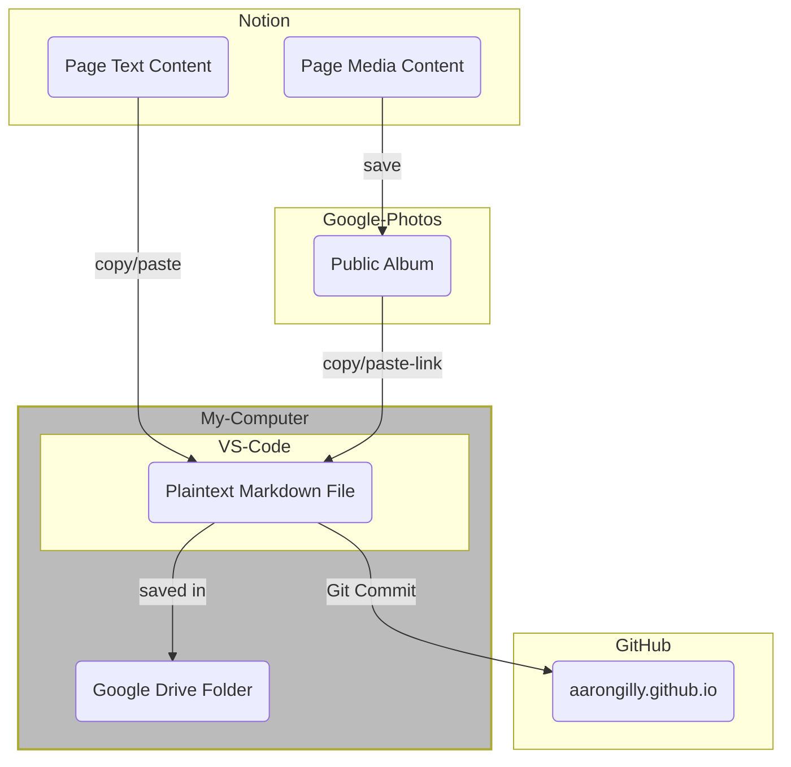

Fun fact: I called this post "AIM Revisited" until it was nearly done, then realized that I’d already written [#401 - AIM Revisited](https://aarongilly.com/401/). Then had to re-do a lot of this post. #401 should be my first inductee into the Pantheon of Good Columns[^1] I'm actually still pleased with after all these years. It’s a good'un. Time will tell on this one. WHO KNOWS!

# New Favorite Tools

These tools are sorted *both* from oldest-in-use to newest, AND from most-favorite-favorite to least-favorite-favorite (if such a thing exists).

## Notion

At this point I’ve maybe written enough about Notion. Since my original ["AIM" Column, #370](https://aarongilly.com/370) in  May of 2019, Notion has completely overhauled the way I organize my personal life. It’s just great.  Everything about how Notion is built is just **exactly** how I think it should work. 

### Simple Examples

- If you type a hyphen followed by a greater-than sign, it auto-converts to an "→"
- If you have a URL copied to your clipboard and select some text in your Notion, hitting "paste" won’t *replace* that text with the URL, instead it will *turn that text into a hyperlink* pointing to the URL. I do this all the time.
- You can just, move stuff around. It’s crazy how much of a big deal this turns out to be - and it’s probably the feature I miss most about Notion when I can’t use it (e.g. at work).
- Markdown formatting. As I’ve said before, [I love Markdown](https://aarongilly.com/gillespedia/markdown/). Notion supports it out the box.
- Slash directives. You can quickly add *anything* just by typing "/" followed by the thing. There are a **ton** of nifty little shortcuts like that. I can type the four characters `@rnt` and get a Notification on all my devices pointing me directly to that block next Tuesday. (@RemindNextTuesday).
- I can export my entire Notion to a directory on my computer, at which point it becomes a perfectly serviceable text-based version of itself. Links are maintained via Markdown internal wiki-style linking. Photos are maintained. I’m not "locked in", and for that reason I’ll never leave. It’s ironic.
- I'm writing this post in Notion. When I copy/paste it out of Notion, it will include the Markdown necessary to maintain *all* **this** ~~formatting~~.

## VS Code

VS Code isn’t really a *new* tool to me, but it’s a new **favorite** tool. For those of you who aren’t coder-types[^2], VS Code is a text editor - which is exactly what it sounds like. It’s a program that lets you write text. In particular, it excels at helping you write *code*... although you can use it quite well as [a note-taking platform](https://marketplace.visualstudio.com/items?itemName=dendron.dendron) (which I would do, if Notion weren’t so damn good), or any other application of writing. And it, like Notion, has a BUNCH of quality-of-life features that enable productivity never before dreamed of. 

### Simple Examples

- Like Notion, you can do *anything* without taking your hands off the keyboard. Navigate the menus super fast, use any of the hundreds of built-in shortcut keys (or define your own), or just press `ctrl+p` and type what you want to do.
- Multi-cursor editing. Click several times in several places, and suddenly you can start typing in several places at once.
- Intellisense - Microsoft’s trademark term for smart code completion. It’s incredible and makes you feel like the bionic man when you can just type "myS" and hit tab to have it fill in the rest of "mySuperLongVariableName".
- Integration with Git & GitHub (both of which should be on this list, but I’ll spare you).
- After I finish this draft in Notion, I’m copy/pasting it from Notion to VSCode, at which point I’ll push it to GitHub. That’s what puts it here for you to read, by the way.
- Integration with all the programming languages you could ever want, including...

## TypeScript

TypeScript is *legit*. I don’t want to code a plain JavaScript app again, because *eventually* it will grow to the point that it will have benefited from the tooling features that TypeScript enables. If you’re not a coder and you’ve heard the of the coding language "JavaScript", TypeScript is basically just *better JavaScript*. I’ve really struggled to come up with an analogy that’s approachable to non-codery-types. Imagine if you had to write legal contracts, and you had a tool that prevented you from mixing up names. Or if you were doing a bibliography, and you could just tab your way through the citations. Imagine if you were writing instructions for how a thing worked, and the instructions built upon themselves such that the more you wrote the easier it became to write... or even if you built an example of a thing and the instructions for how to build it just sort of *wrote themselves along the way*.

TypeScript is sort of like that. It’s JavaScript, but with some added features. It’s something I’ve only been using in earnest for a couple months now. I love it. I'm not going back.

### Simple Examples

- You can write TypeScript using modern features, then transpile back to older versions of JavaScript, allowing you to use great time saving techniques in environments that otherwise wouldn’t allow them.
- It helps you document the code you’re writing *as* you’re writing it. The code is essentially *self-documented*. If you want it to, it’s [literally self-documenting](https://typedoc.org).
- You are super-powering Intellisense. You cannot forget to include some necessary argument in a function. You won’t forget what sort of thing a function does for you - especially with the help of the JSDoc standard, which is built into VS Code.

## Diagrams as Code

A picture is worth 1000 words. So if you can create a picture using a couple dozen lines of code, then you’ve turned a couple dozen lines of code into 1000 words. You can write some simple-to-lean code and easily turn it into complex diagrams. I’m a visual person, so I love diagrams... but changing how a diagram looks is easier when you can save version-controlled iterations of a diagram, and when you can just worry about the connections that need to be made without having to worry about how to physically **draw** them..

When it comes to diagrams as code, there are a few competing standards in the "code into pictures" arena: DOT, PlantUML, and Mermaid. I’m going to save the rest of my discussion on this for a future [Gillespedia](https://gillespedia.com) Article.

### Simple Examples

This code turns into the diagram below it:

# Top 5: Companies I’m (Currently) Fully Bought Into

## 5. Wyze

Cameras, doorbell, light switches, light bulbs, outlets, vacuum... you know. Stuff.

## 4. Ryobi

Drill, driver, multitool, circular saw, reciprocating saw, router, rotary tool, flashlight, work light, bluetooth speaker, air pump, pin nailer, miter saw, and table saw. Plus bit sets snd other odds and ends.

## 3. American Tall

Genuinely every item of clothing I wear is from American Tall - aside from underwear (Pair of Thieves), socks (Darn Tough) and shoes (whatever works).

## 2. Notion

[782 Notes](https://www.notion.so/a7627b8ed78b4eab9e31364cb7b98eea), 194 Projects (include 30 Columns and 50 Podcast Agendas), [92 Creations of the Week](https://www.notion.so/9e6c767be05a42c7ab438e4330658e2b), 85 thirty day challenges, 80 periodic reviews, [78 sources](https://www.notion.so/e301531cc1ee4ad7ae537d87f9681116), 66 goals, 43 Resources, 19 Life Areas... I reckon I spend 45+ minutes on Notion every day.

## 1. Costco

Kitchen table, TV, couch, loveseat, mattress, pressure washer, & groceries every few weeks. Probably not as impressive of a dedication as #2, but man... Costco is great.

# **Quote:**

My son is 3, and won’t be saying these kinds of funny things forever. That makes me sad.

> I’m using my might to make a cookie. 
<cite>My son</cite>
> 

> I love to play Lucalalies 
<cite>My son</cite>
> 

> The water needs more batteries
<cite>My son</cite>
> 

[^1]: ...and now I have to actually make a section called "The Pantheon of Good Columns"

[^2]: Honestly maybe just bounce right now if that describes you. This post isn’t for you.
