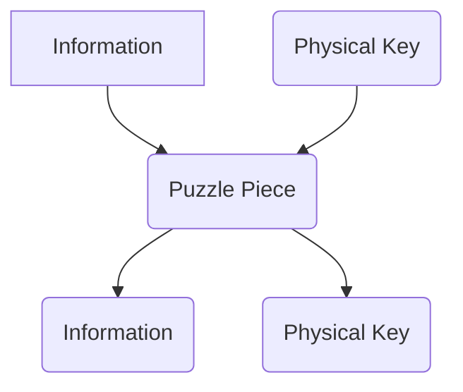

I make no claim at being **good** at any of this.

# Extended Preamble

This is not going to live up to your expectations.

Creation is like love. It comes from a place so deeply seeded within that it doesn’t feel like it can be treated like just any other topic. It’s not easy to write about. It's not easy to explain. If you don’t feel the urge to make things that didn’t used to exist… I can’t help you with that. 

I can't explain why I want to make things. I just do, so I just do.

What this Column is about is a how-to guide for (one-implementation of) the *mechanics* of making. It will start after the point at which an inspiration and desire has struck.

## Economics of Creation

I am privileged. While financial considerations are made in what transpires below, I recognize and appreciate the position I am in to even feel like I could begin to write this Column. 

```mermaid
graph LR
i[Money in] --> m(materials)
i --> ce(equipment)
m --> c((Creating)
ce --> c
in>inspiration] ---> c
c --> co(Creation itself)
c --> o[Money Out]
style o fill:#afa
style i fill:#faa
```

I am only qualified to talk about some pieces of that diagram. I've literally never once converted a podcast, blog post, video, poem, drawing, woodworking project, electronics project, website, or puzzle for money… but I've certainly **spent** $1000s in the pursuit of creation[^1]. 

I think if I tried to create for money it would take away something from the process - or maybe that's the story I tell myself because I'm afraid nobody would pay me for the things I make.

# Equipment

|  | iPad | Computer | Special |
| --- | --- | --- | --- |
| Coding |  | Need |  |
| Drawing | Optional |  | Paper & Writing Implement |
| Making | Optional | Optional | Depending on the project, any of a litany of tools. Particularly a drill/driver, circular and jigsaws, and clamps (ideally more) |
| Music  | Either/or | Either/or | Music instruments, particularly a piano |
| Writing | Either/or | Either/or | Writing utensil and paper, or your phone |
| Website |  | Need |  |
| Puzzles | Good | Better | All sorts of arts and crafts stuff can help. Use what you’ve got. |
| Photography | Good | Better | DSLR, or just your phone, and good lighting |
| Video Production  | Good | Better | Your phone, or a DSLR, and good lighting |

# Creations

## Writing

Literally just pick a thing to write in and write whatever comes to mind. If you want other people to read it, see the next paragraph.


Money in: probably none


Money out: probably none, unless you have some sort of hookup. I’ve got friends who’ve made money writing.

## Blogs and Websites

There are so so so many ways to write a blog or make a website for free[^2]. All it takes is a tiny bit of willingness to learn.

There are dozens if not hundreds of ways to do this. Here are 4 broad approaches, ranked from easiest to least easy.

1. Squarespace or something. Pay them probably $10/month. I'm sure they make it easy.
2. Google’s Blogger and other “blogs for free” services exist. You have the least control over this type of service. Your blog is actually theirs. You just wrote it. 
3. Use a static site generator, like Jekyll or Hugo. This is what this blog is. 
4. Build a fully-custom static site using whatever technology you like. This is the approach my Personal Data Warehouse and puzzle box project both use. 

My process involves writing my post out in Notion. Then copy/pasting it from Notion into a plaintext document on my computer. Notion automatically includes the necessary markdown to maintain formatting. I do a couple of tweaks to ensure the images look right, and then click a button in Visual Studio Code that pushes the new text file to my GitHub repository. Viola that’s it.


Money in: as little as you want.


Money out: probably not a ton. Or if you're like me and don’t put advertising anywhere then just straight up zero.

## Coding

Coding is a hobby of infinite depth. You can pick up coding and literally never stop learning new stuff and getting better. You can code for fun. You can code to learn how to make (a lot) of money. You can make websites, apps for devices, or do work in cyber security. Coding helps (but is not required) for the paragraph above and the paragraph below.

There are lots of good ways to get started coding. It helps to have some sort of an idea of a thing you'd like to make... but even if you don't have that there are plenty of bootcamps or courses you could take. I'm mostly self-taught, which means I learned from *everywhere* rather than through some formal training. That said I did use https://freecodecamp.org to great effect. 

In terms of the mechanics of coding, it obviously depends on what you're working with. If you, like me, are doing mostly web-based stuff - it's easiest to pick some framework you want to work with and run through whatever the setup procedure is for that. I start by using Vite (my preferred tooling solution) to scaffold a new project in whatever framework, then pushing to a new Git Repo on [Github](https://github.com/aarongilly) from within VS Code. From there it's crazy widely varied according to what you want to do.

If you're wanting to make an app for iOS or Android, you'll need XCode on your Mac or Android Studio on whatever computer you have. I've got less experience with both of those, but they both have "new project" workflows. I'm looking forward to finishing my current Personal Data Warehouse re-re-re-re-re-re-re-re-re-rewrite so I can spin up an iOS/iPadOS based version and learn how to develop on those platforms.


Money in: zero, assuming you already own a computer.


Money out: Potentially a *ton*. Even if you don’t make a best-selling application, just being **able to** make an application is enough to get you good jobs.

## Making Puzzles

Unless you have an absolutely killer idea, it’s best to get started making a puzzle by first determining who you’re making it for and how they will interact with it. If you’re making something for someone for their birthday party, it probably shouldn’t be for **just them** and take their whole night. If you’re making something that’s repeatable, it needs to be general and be able to be re-assembled.

When making puzzles, it’s rare (if not impossible) to come up with something wholly unique. Generally there are only so many types of puzzles that exist, and what’s done nearly all the time is finding fun or unique ways to mask what they are or combine them in novel ways.

I started by identifying the constraints I wanted to work within. It needed to be portable, cheap, accessible to anyone, and doable in roughly 45 minutes. I liked the puzzle box concept, from having used it in the past. From there I brainstormed themes that might both be fun to work within and explain **why** someone was trying to open a box. 

Always keep an eye open for things that can be used as puzzle pieces. [Everything is a remix](https://youtu.be/zd-dqUuvLk4). I had a few ideas I was really enthused about, and thought about what they needed as inputs and what they provided as outputs. Generally a puzzle gives you physical access to something or tells you information… and solving puzzles requires physical access to something or information. It’s reciprocal.



Basically a puzzle is just a chain of puzzle pieces. Ideally not presented sequentially (like dominoes) and using a nice mix of varieties of puzzles and also in terms of quantities of inputs required and outputs produced. 


Money in: basically as much or as little as you want. Write “you suck” on a piece of paper and cut it up and give it to your buddy to reassemble. Free fun.


Money out: probably none. Even if you’re me.

## Video Creation

Okay by this point in the Column I’ve realized I’ve been way more than I should chew so we’re speeding up.

You don’t need a fancy camera to make good looking videos. You do need better lighting, probably. Film outside or near a bunch of windows. Video editors are more or less all equally capable at this point. Something like iMovie would totally suffice for the average Joe. If you have more money and want to spend more time tweaking and messing with how things look, then you can move on to bigger products. There's an **incredibly** long tail to this, though. You can get a great looking video out of iMovie and good lighting and garbage out of Final Cut Pro with bad lighting.

The iPhone 14 with Cinematic Mode shooting works really well with Final Cut Pro. I got it for $100 as part of a student discount + Family sharing perk cause my wife is a teacher. Now that I have a legitimate video editor that isn’t constantly trying to sell me on upgrades and effects packs, I doubt I’ll ever switch to anything else.


Money in: you need a phone or a camera at a minimum. Lighting helps. A computer on which to edit video is also essentially required. After that costuming and props and whatnot can get expensive.


Money out: YouTube **can** earn you money. Realistically, though, you’re not likely to make a killing in terms of money out versus money in unless you’re lucky.

## Making

Honestly what was I doing with this. Making depends on what you’re making. Just try to make the thing. Google and YouTube are your friends. Don’t go crazy buying supplies or equipment until you’re sure you have a good, immediate need for the thing. You’ll end up with a drawer full of stuff you never use.


Money in: Hard to quantify. Almost certainly you’ll be spending at least *some*, potentially a lot.


Money out: none, unless you sell stuff. You can make decent money on Etsy, or so I’ve been told. If you make a thing that can also be mass produced easily - then boom you’re golden.

## Music

If you've got an instrument. Play the instrument. If you’ve got a Mac or an iPad, play around with GarageBand. It’s **awesome…** and super fun. And, much like coding, is an incredibly **cheap** hobby in the long run. You can continually learn and get better forever, and spend essentially $0 while you’re doing it. Unlike coding, music naturally lends itself to shared social experiences (jam sessions, singing together, or playing as part of a band) which are very rewarding in and of themselves[^3].

If you have a guitar: EADG. Boom you now know guitar. (I included this bit to annoy Ed, if he reads it. HI ED)


Money in: an iPad’s worth, or a keyboard or guitar or whatever (or none: just sing)


Money out: probably none, unless you’re pretty good and try to make money with it.

## Drawing

Just draw the thing. YouTube tutorials if you’re having a hard time. Classes also exist but definitely aren’t required. Just draw the thing. If you’ve got an iPad and Apple Pencil you have effectively infinite access to what's necessary and used by professional artists. If you don't have those, you just need paper and something that leaves lines on paper.


Money in: an iPad’s worth… or none


Money out: probably none

# Conclusion

See everything above. I’m biased. Sorry this was so long. Hopefully you just didn’t read it.


# Top 5: Standards that Suck


## 5. Live far apart and drive everywhere

Cars suck. The fact that America is built around the assumption that everyone has ready access to a car is bad. If I could live in a world wherein I rode my bike everywhere and wasn’t in danger of being mowed down by an F250 with one person in it that’s never hauled anything…. that would be great.


## 4. Kids clothing sizes

So kids clothes are just… impossible. What’s 4T in one brand may be more like 6T in another. Also the numbers sort of correlate to age, but also not really. Each kid is too unique. They should just be based on weight and height. Boom. Unambiguous and straightforward. Yeah you’d have to know how much your kid weighs and how tall they are, but you can measure those things independently, and then know them for every single store you might go to.


## 3. Subjective rules in sports

[I’ve written about this before](https://aarongilly.com/322). That list was basically for comedic purposes… but the fact that so much subjective judgement is wrapped up in a thing that so many people care about so much is unfortunate. 

THAT WAS A CHARGE! NO THAT WAS A DEFENSIVE FOUL! NO IT SHOULD HAVE BEEN NO CALL!

THAT WAS HOLDING! NO IT WAS FAIR PLAY!

BALL! NO STRIKE!

I don’t follow sports in any way, shape, or form - and still I’ve heard enough cries of unfair calls in my life. Part of the reason I like pool is that the “judges” in pool almost **never** get involved. Generally it’s pretty objective. Track & field is good, too. I’m just not fast enough to partake.


## 2. The hierarchy of calendars

It's an unfortunate fact that the year is basically 365 days long. The prime factorization of that number is 5 and 73, so that doesn't leave a lot of flexibility, admittedly, but this is ridiculous:

1 year = 12 months. 1 month = 31 to 28 days. 1 month = 5ish weeks. 1 week = 7 days.

I still wish we had a month & week system like this:

1 year = 12 months. 1 month = 6 weeks. 1 week = 6 days. 

The extra 5 days (or 6 on leap years) would be a holiday, happen all at once, not really be considered a week or a month, and mark the transition between years. If that system doesn't sound easier than what we’ve got then you’ve never tried coding things that involve dates or organizing long-term projects. Also a 4 on 2 off work week sounds so much better than 5 on 2 off.


## 1. Red and Green Color Coding

When it comes to generic color coding schemes, the most prevalent convention is to give green and red opposite meanings. Whether it's “good and bad” (like what you'd see in a business dashboard) or it's “go and stop” (traffic light), we have decided to use specifically these two colors the most often. You know what else these to colors show up in the most often? Colorblindness. The red-green color blind variant is the most common one.

We could have collectively chosen any two colors to mean opposite things. If you require them to be on opposing sides of a color wheel you have two other choices. “orange/blue” or “yellow/purple” would both be more widely discernible, but no. 

If you're colorblind, I'm sorry for being complicit in this wrong choice and how it's affected you.


# **Quote:**


> When I’m a superhero my name is Megalanestis. 
> <cite>My older son - code name Megalanestis</cite>

[^1]: …just this year ….and it's March

[^2]: If you **do** care about having a custom URL (something like [https://aarongilly.com](http://aarongilly.com), for example) you will need to pay for it to be listed in a Domain Name Server (aka “DNS”, aka the thing that turns “google.com” into an IP Address of one of Googles servers). That is not expensive. I pay $12/year through Google Domains for to make it so aarongilly.com takes you to my website. If your satisfied with something like [aarongilly.github.io](http://aarongilly.github.io) then you don't need to pay money.

[^3]: From what I’ve gathered via a lot of second-hand experience.
