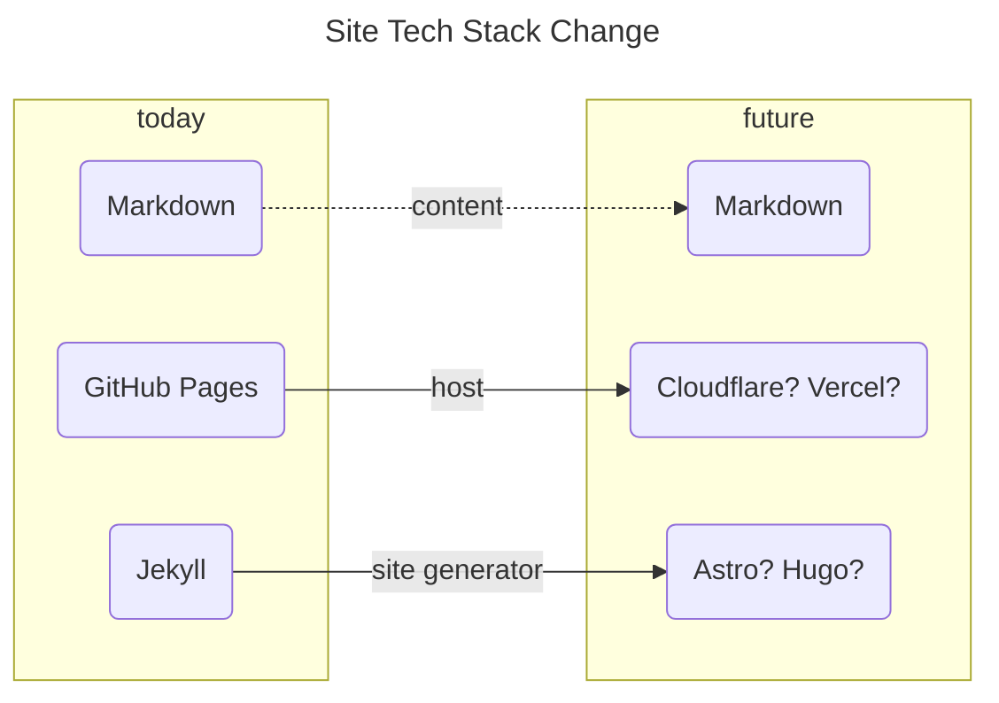

This topic, the intersection of philosophy and technology, is probably my favorite and most-covered topic over these past 437 Columns. Technology is like fashion. It’s never “done”. With each new development in technology, there’s reason to think about what rights and wrongs come from it.

# Consumer Tech Form Factors

## The Smart Watch

My favorite class of consumer electronics is the smart watch. A smart watch adds the most benefit with the fewest drawbacks.

My Apple Watch:

- allows me to message people
- handles short phone calls
- handles timers, alarms, reminders, etc
- tracks and report on my exercise
- allows me to run shortcuts and ask Siri questions
- allows me to find my phone, unlock my computer, and do other ecosystem stuff
- shows me the time

My Apple Watch will NOT:

- allow me to accidentally ruin an evening looking at the internet

It facilitates health and connection. It doesn't demand your attention. You won't see people who are lost in “their watch”. 

## The Smart Earbuds

A new piece of tech I wouldn’t want to live without is some nice, noise-canceling earbuds.

My AirPods:

- Allow to me focus on the task at hand
- Read me books while I mow
- Protect my ears while I mow
- Blunt the harshness of a 2 year old throwing a tantrum (just using them as earplugs, even without anything playing)
- Allow me to take and make hands-free calls
- Allow me to interact with Siri

The AirPod **does**, though, have a large portion of the blame for making random people less approachable. Little white earbuds are now ubiquitous, making idle chit chat between strangers waiting in line less frequent. They are too good at “shutting out the world”.

## The Tablet

Tablets are the most “fun” class of consumer electronics. They are probably the most versatile piece of consumer electronics available.

My iPad:

- Is my favorite way to browse the internet
- When combined with headphones, is much better than a TV for solo movie watching
- Is an infinite piece of paper and an impossibly capable pencil that never runs dry
- Is a CAD device that can also scan in 3D models
- Is capable enough for a hobbyist for editing music, videos, photos, and podcasts
- Is what I’m writing this Column on
- Is more capable of playing games than I give it credit for[^1]
- Is a good way to read books, PDFs, etc
- Allows me to markup PDFs, I can even do crosswords with the Apple Pencil

While it is very easy to lose a night playing around on an iPad, I find that when I'm on it I'm generally doing something more worthwhile or productive… or at least I'm enjoying myself more than comparable time spent on my phone.

## The Rest

The **computer** still has its role. For as much as I love my iPad, there’s still no great way to write code on an iPad. I’ve looked into it, trust me. Every solution out there doesn’t *really* work as well as having VS Code and a full internet browser on my computer.

The **smart speaker** was a not-so-brief flash in the pan, I think. We have a ton and we use them every day - but for reasons I’ll get into in my next Column… I’ve been thinking Alexa isn’t actually “adding” to my life. Having ready access to decent sound, especially sound that can be piped simultaneously to multiple speakers around the house, still feels like living in the future to me.

The **TV** is the best thing for communal experiences. The only piece of tech that my family and I can really enjoy simultaneously (aside from music from the speakers).

Finally, we have **the phone.** The phone is really only “the best” as a camera. In every other way the phone is outmoded by something else in the ecosystem. This gets to the point I'm trying to make here…

## Unsupported “Ideal”

Screw the phone.

Apple assumes everyone has an iPhone. It's the primary device. It's the de facto “king” of your technology, as ordained by the church of Cupertino. You cannot use an iPad and Apple Watch together without an iPhone to bind them. 

![[438-2.jpg]]

In a hypothetical world where I lived a “digital nomad” life, or just adopted brazen minimalism for whatever other purpose, I could see really enjoying a “Apple Watch + AirPods + iPad + Mac” setup[^2]. As previously mentioned, the **only** thing you'd *really* be missing is the stellar camera on the iPhone. The simple removal of the little device in your pocket would free you from the tyranny of the ubiquitous access to the addictive little dopamine device. I think life would be better.

# Odds and Ends

- We took a vacation to South Dakota to obtain a new brother-in-law/uncle for my sons. He's good. Vacation was good. Wedding was good. Pretty idyllic situation overall, I'd say.
	- We took our Model Y on a road trip for the first time. More thoughts on that in my next Column.
- I just discovered that holding the "option" button on my iPad allows me to easily access weird off-keyboard characters, easy as π.
- My back, neck, and shoulder are **still** hurting from the work I did fixing our backyard water feature over a month ago. Possibly related: I turn 35 next month. 🙃
- Said water feature is finally functional again, though!
![[438-1.jpg]]

# Top 5: Potential Site Changes to Come

I try not to promise changes to the site, but here’s some I’ve been thinking about. 

## 5. Re-introduction of ‘Gillespedia’

It didn’t go away. I just hid the link. I have several articles I’d like to write. Arguably this post should have been one.

## 4. Folding in of My Notes

If I switched from Notion, I'd figure out a way for my notes to live in the Column, as well.

## 3. More Integration with Get In To Win

There's one link right now. Ideally this could better support that, and any future podcasts I may formulate.

## 2. The Still-Outstanding Deep Dive on the PDW

I am planning to write an “all about it” page. What it is and how it works, both from a laymen's perspective and a technical one. 

## 1. TOTAL OVERHAUL

I’m interested in moving this site from its current tech stack to something else entirely. You’ll know this happened if suddenly one day the site looks totally different.

# **Quote:**

> Look at those stinky stunks! 
<cite>My 2 Year Old, who calls skunks "stunks", about some guinea pigs at the local pet supply store</cite>
> 

[^1]: What sucks is that the Nintendo Switch is **way** less powerful than my laptop from a “raw compute” perspective, yet the iPad doesn’t have Zelda, Hollow Knight, or Smash Bros

[^2]: I recognize with some level of shame that, to me, “brazen minimalism” would be having 4 very expensive pieces of consumer tech. I obviously write from a place of privilege.
