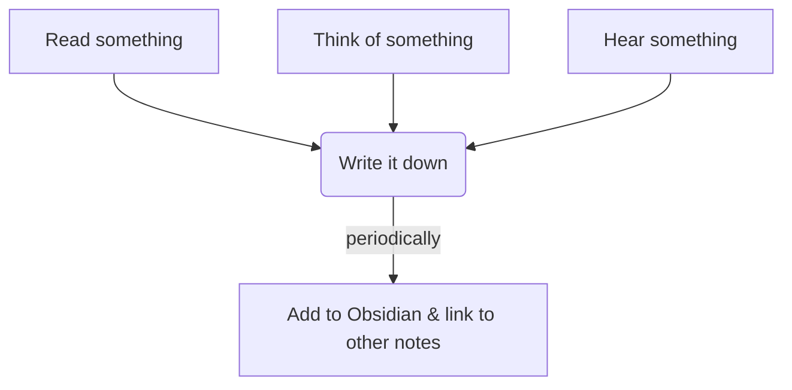

This post is mostly a link to [this](https://gillespedia.com).

# The Notes are Back

~6 months ago I switched by body of evergreen notes from [Notion](http://notion.so) to [Obsidian](http://obsidian.md) as part of an effort to give these notes the best chance of still being around in 30 years. With that came the loss of the free notes publishing service. While Obsidian is stellar, their subscription for their publishing service is slightly too pricey for my taste at this point in time[^1]. So, I was unable to publish the 256 notes I’ve created since July, 2023.

That’s changed now: 

> [!tip]  [My notes](https://gillespedia.com).

That’s the master index. The notes aren’t laid out so that they can be read end-to-end[^2]. Instead, they’re this densely interlinked web:

![[449-1.png]]

Each of the circles in that image is a note. The lines between them represent hyperlinks. The color are bound to tags[^3]. So, as an alternative to the link above, see the Top 5 for five somewhat randomly-chosen starting off points.

## The [Standard Process](https://gillespedia.com/Standard%20Processes)

Despite how *involved* this whole thing looks, it's really not all that crazy or difficult.

It just involves using an [inbox](https://gillespedia.com/Inbox) to perform [ongoing capture](https://gillespedia.com/Ongoing%20Capture), and periodically cleaning it out. It's [nibbling at the elephant](https://gillespedia.com/Minimum%20Viable%20Progress), a [little bit, consistently](https://gillespedia.com/Small%20but%20Consistent%20beats-Big%20but%20Sporadic), [over time](https://gillespedia.com/Prefer%20a%20Long%20Term%20Philosophy).

**Note:** I don't plan to do this "linking to my notes everywhere" thing in most Columns. Doing it here because it's the point of this post.

# Other Local-First Changes

5 months ago I wrote about “[local vs the cloud](https://aarongilly.com/439/#notion--obsidian)” and my intention to become (slightly) less dependent on hardware & services that might [pull a Google](https://killedbygoogle.com). I presented my “[so what](https://aarongilly.com/439/#so-what)” to illustrate what I was going to do about it. Since that time I *also* successfully moved my quantified-self system to something that’s modularized and portable. I can run it locally, too.

Yay me.

# Top 5: Good Example Notes

The following five notes were selected somewhat randomly, but represent a cross-section of my notes.

## 5. [SysML](https://gillespedia.com/SysML)

## 4. [Tax-Advantaged Accounts](https://gillespedia.com/Tax%20Advantaged%20Accounts)

## 3. [Ideal Exercise Regiment](https://gillespedia.com/Ideal%20Exercise%20Regiment)

## 2. [Enough](https://gillespedia.com/Enough)

## 1. [Calendars are the Most Important Productivity Tool](https://gillespedia.com/Calendars%20are%20the%20Most%20Important%20Productivity%20Tool)

# **Quotes:**

> What’s a “wack”?.  
> <cite>My 5 Year Old, in response to being told he had wax in his ears</cite>

> Seltzer for my homies  
> <cite>Fintel</cite>

> Gangster Bean Trading  
> <cite>Krista</cite>

> I'm relatively good at extemporaneous speaking, so let's see how this goes.  
> <cite>Erik</cite>

> I live my life one egg corn at a time  
> <cite>Nick, who will probably forget he said this</cite>

[^1]: There’s a good chance this will change and at some point I’ll decide to subsidize their product by paying the $8/month their asking for to do something I can do for free.

[^2]: nor should any sane person want to.

[^3]: actually they're there to look pretty, mostly.
