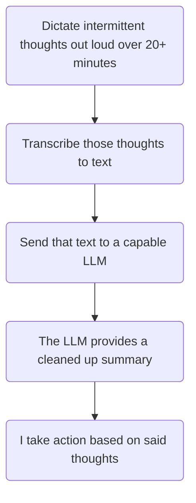

# Things are *Still* Good!

I haven't technically "graduated" yet... But grad school is done! I should probably celebrate that at some point.

[The Data Journal Guide](https://datajournal.guide) is 90% finished for the original planned content.

I'm now "[TOGAF Certified](https://en.wikipedia.org/wiki/The_Open_Group_Architecture_Framework)". So if you ever need some enterprise architecting, I guess I'm your man.

Our [[488#100 Day Glow Up Re-doing 75 Hard (sort of)|pseudo 75-hard]] is going **really well**!

We did a small upgrade to our small deck and we love it. Especially in the spring time. I'm writing this on it right now. Makes us feel like this:

![[489-1.jpeg|574]]

And other good things may be on the horizon!

# AI Thoughts
## AI will Influence "Normal"

AI has a certain *style* of writing. 

Everyone who regularly works with AI is being exposed to this style of writing.  

In effect – it's like we will all have the same friend whom we go to for help writing & proofing things. 

I have already consciously adapted my writing style **to mimic the effective style of AI**. 

👉 I'm accentuating this effect now, *but not by much*.

## Local Large Language Models are Pretty Good!

As I [[487#Apple's Entry-Tier Offers are Good|previously wrote about]], I own the entry-level Mac Mini. 

On it, I can run local AI _(meaning private and no internet required)_ using Ollama + open-source AI models... for _free_.

1. Install [Ollama](https://ollama.com)
2. Install an [AI Model](https://ollama.com/search) (which Ollama helps you do)
	1. The new [gemma4](https://ollama.com/library/gemma4) is quite solid 
		1. → I'm running `gemma4:e4b` locally

And guess what? They are getting pretty good! Even for my low-powered baseline Mac Mini. The quality and speed of the results are "good enough" for day-to-day use.

And what's great about this is:

- **Usable:** I can run as _many_ prompt cycles as I want.
- **Sustainable**: I don't feel like running this is hurting the rainforest (I'm using my own machine, and it draws very little power).
- **Perpetual**: I never have to worry about _this_ simply "going away"—it's mine, and it's on my hardware.

> [!success] Used it for this
> I used it to help draft & edit this blog post. I actually do **not** run my Columns through AI as a rule, but this time I've made an exception.

# Tool I Want

There's a workflow I've tried to approximate, but I haven't found the right solution for it yet.

**Situation: I'm driving, or riding a bike.**

I know I have the necessary tools to do this, but they don't remain configured or operational when I need them most.

Hopefully after WWDC this year we'll learn Siri can do something like this.
# Superpower Unlocked

I finally recognized the terminal for what it is – an always-available scripting environment. 

Duh.

I'm not sure why I never thought to really trying playing with it. It's *awesome*. 

Turns out all the stuff I liked JavaScript and the browser for... you can basically just do with whatever language.

Duh.

This might be the biggest thing I learned in grad school. 

# Apple Pi

With the advent of the [[487#MacBook Neo Mini Review|MacBook Neo]], which utilizes an old iPhone chip to drive a full MacBook, it makes me wish there was an "Apple Pi".

> [!summary] Apple Pi
> A Raspberry Pi, but using an old iPhone and running MacOS

If the MacBook Neo can turn a profit for $600, Apple could easily take out the screen, keyboard, battery, case, and turn a profit for, what, $200? Probably less! And it would be as good as my MacBook Neo? Sold. Sold millions.

# Vehicular Mansplainer

Vans are trucks that look like cars. 

SUVs are cars that look like trucks. 

# Top 5: Back-Burnered Projects I May Do Next

## 5. Built-ins in the basement

## 4. Fix the broken old puzzles on [Aaron's Puzzles](https://aaronspuzzles.com)

## 3. Build a generic systems modeling tool

For some reason this idea has kept coming up for most of the past decade. I found plans for this written in a notebook dated 2018.

## 2. Film a "You Should Make a Data Journal" video

In 2 days the Data Journal finishes it's 13th year and begins its 14th. 
## 1. This year's puzzle box

Obviously.

# Quote:

> Spherical bastards. Bastards no matter which way you look at them.
> <cite>- Physicist Fritz Zwicky</cite>

> You know what you call a med student who graduated with all D's?   
> A doctor.
> <cite>- Zane gets back-to-back quotes</cite>