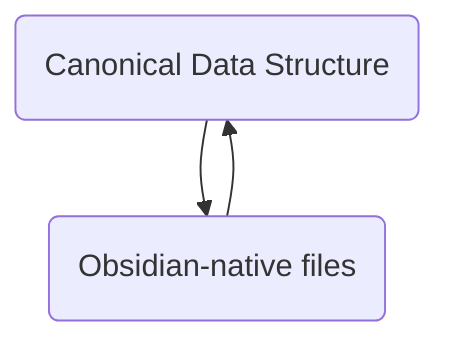

This is a [now page](https://sive.rs/nowff).

I am currently working on these things…
## Living
First things first, enjoying the prime of my life.
## 75 Hard
Doing a 75 Hard is consuming much of my free time.
## Semantic Canvas v1.2
Adding lots of neat-but-obvious features that will make the [[Semantic Canvas]] plugin more useful. 
## Obsidian as a PDW
I have my [[PDW]] framework, which I’ve realized recently that Obsidian could definitely fit into. If I can figure out mass import & export to my [[PDW#Data Structure]] then I will migrate from my cloud-first approach to a local one. 

## Puzzle Box
Designing & building a 2024 Puzzle Box - “Brief Mystery”
![[creations-brief-mystery.svg]]
