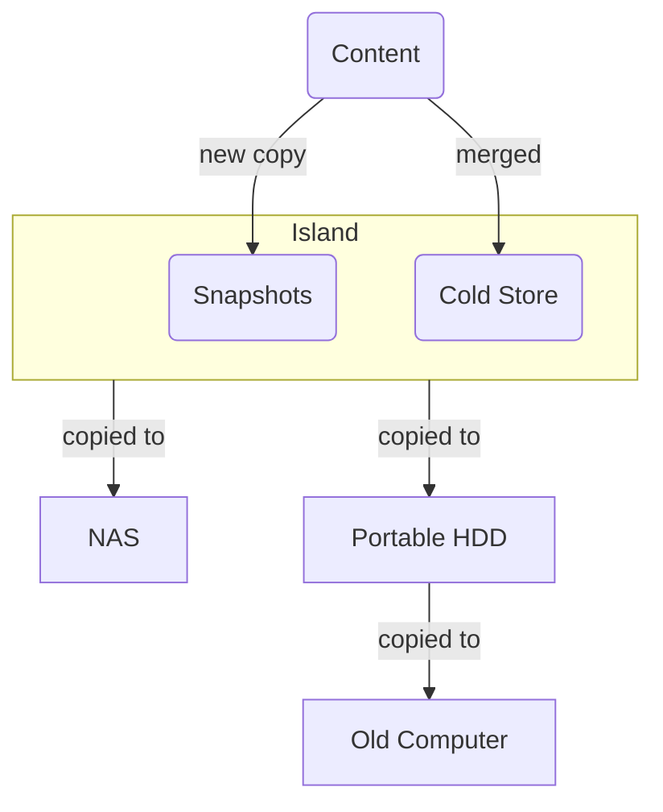

---
tags:
  - creation
  - creation/other
date: 2024-08-23
---
Process. Also a python script to execute said process.

Finally settled on a good, sustainable (feeling) strategy for achieving the [3-2-1 Rule for File Backups](https://gillespedia.com/3-2-1+Rule+for+File+Backups). 

## Islands Strategy
I'm making a folder called "Island", which has my backups in it. The island folder is split into two parts - one titled "Cold Storage" and other dated with the ISO 8601 month. 

> [!tldr] "Backup Island" Folder
> A folder, replicated in multiple places, consisting of 2 subfolders:
> 	- **Cold Storage** = merge file & don't overwrite pre-existing files
> 	- **YYYY-MM** = create new snapshot containing current versions, retain old snapshots

### Cold Storage
Cold storage is for files that don't change often. Things that, once they exist, they are pretty much "done". These are the **vast majority of files** by storage size. 

- `media` - what's in my Plex + some books & audiobooks
- `documents` - copy of my "documents" folder, essentially all of which will never change (e.g. Scans of physical documents)
### YYYY-MM Snapshots
These are folders that contain files that are rapidly changing. The kinds of things you would want to retain some history on, in case of latent accidental deletions in the working directories. For me that's my [blog](https://aarongilly.com), my [notes](https://gillespedia.com), my [[PDW]] data, and Obsidian-based journal.
