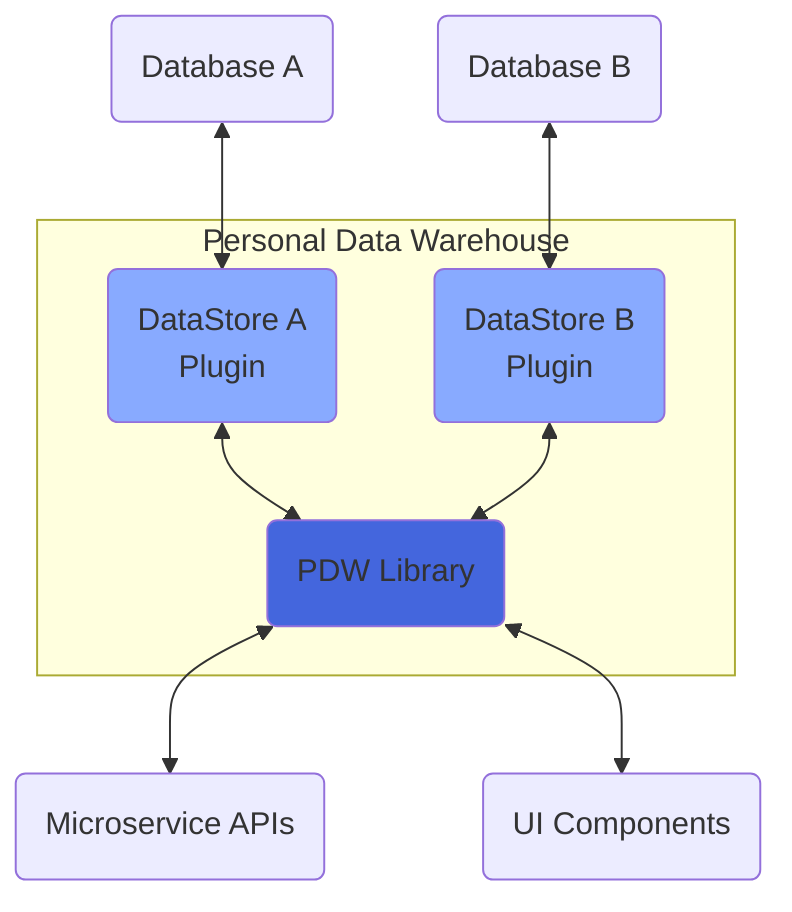

I have maintained a life-tracking project since 2013. If you’re interested in that, this page is for you. Hopefully it will answer your questions.

# Who

I did this, which means you could do it too.

# What

The Personal Data Warehouse[^1] is a system I built to help me keep track of stuff that happens in my life. It is a time-indexed ledger of anything I want to keep track of and measure. It is the low-friction system of inputs, storage location(s), and query/reporting mechanisms that allow me to capture, retain, and interact with any time-bound data that might seem interesting. It’s a web app, code library & some plugins, few dozen Siri Shortcuts, some IFTTT Applets, some data structures, a couple of Scriptable scripts, and a few microservices I built. It enables automated data inputs from anything that can generate arbitrary web requests, manual inputs through a web interface or bulk file imports. It provides structured data via my own home-grown API to access, collate, and ultimately benefit from all the entries it houses. It’s nothing more than you could do with spreadsheets[^2], but it’s mine.

This loop shows an overview of what I tracked over the years:

![[pdw-Tracked.png]]

The PDW allows me to answer questions like:

- “When did this pain in my back start?”
- “How many miles have I run this year?”
- “When was the last time I hung out with this person?”
- “How many drinks have I had the past few weeks?”
- “Have I eaten out more or exercised more this month?”
- “Have I met this goal I set for myself?”

# When

I started with a pen & paper back in 2013 and haven’t stopped since. You could start _today_.

As far as _when to track things_ - tracking inputs happen as frequently as you want them to. I track stuff from once/week or fewer all the way down to multiple times a day. Depends on the thing, how easy it is to track, and how much value I get by tracking it.

# Where

In concept, the PDW could be built using anything that can hold data. Bullet Journalers use their physical notebooks to collect PDW-like data. It’s easier to scale over time if you use technology. Easiest of all if you put it in the cloud. Mine has lived in various homes:

- Paper + Excel
- Google Forms + Google Sheets
- Glitch + MongoDB
- Firebase Hosting + Firestore
- Vercel + Firestore (& JSON/YAML/CSV/XLSX files)

On my most-recent rebuild of the concept I focused on making the system application & platform-independent. The new system works with the cloud or locally. Its core code is uploaded to NPM (alongside a few plugins I wrote) and available for anyone to use.

As I’ve written several times before, eventually I will make a phone app out of this. I think the system itself wouldn’t have to change, just the language and APIs I use to interact with device storage and UIKit.

# Why

There are a bunch of reasons “why”…

- fantastic memory recall of the past
- better attention paid to the present
- having a framework around which future goals can be built and maintained
- specifically in my case - having a **great** testbed application and reason to learn to code, system design, and how to make things work

…but honestly, my best response to the question of “why” is _”why not?”_

# How

This is why I made this page at all. This is what separates this page from my [5 year](339), [7 year](391), and [10 year](444) retrospectives on the project.

If even one person benefits from reading this I will be very pleased.

I am going to cover how my thing works, but also how I’d recommend someone who’s interested in this concept get started.

**Spoilers:** I don’t recommend doing everything I’ve done. There’s a strong argument to make the system is _worse_ now than when it was all one fancy spreadsheet. There’s a sweet spot and I passed it[^3].

## How I’d Recommend Tracking

Ask yourself: 
- What you want to capture? 
- What you want to _do_ with what you capture? 
- What technical skills do you have now, and what skills are you interested in developing?

### When You’re Just Getting Started

There are plenty of options to get you started. I’m not going to go into any of them in detail, but try any of these to begin with before trying to make something fancy.

- Use a Google Sheet, or a few Google Sheets, maybe along with Google Forms and/or IFTTT.
- Spin up a Notion database based off some habit tracking or journaling template that you like.
- If you’re mostly interested in habit tracking, I’ll plug one of my favorite apps [Streaks on iOS](https://streaksapp.com/).
- Just carry around a notebook and a pen. I tracked with a pen and paper for a year, manually transcribing to Excel (if desired), that worked fine.

Track things to the best of your ability, either throughout the day or just at night before bed. Put it in your calendar or to-do list. Review after a month or so. Make adjustments.

This is the best place to start. Don’t jump in and try to perfect things out the gate. You won’t know what’s working until you try it, so just get started with something basic. You can evolve your system from there.

### Once You’re a Bit More Serious

If you decide to get a bit more serious about it, the best bang for your buck toolset is **Google Sheets + Google Apps Script** _(Google’s macro-like scripting engine behind Google’s productivity suite)_. It’s been the best tool for the past 9 years, and has only gotten _stronger_ since I started using it.

I recommend creating a single Master Workbook, setting up one sheet per each level of granularity you care to track. At a minimum I’d recommend `Daily`, `Weekly`, `Monthly`, and `Yearly` sheets. Each row in these sheets corresponds to one period of time. Create columns for each type of data you want to track in whatever sheet it belongs in. Create a Google Apps Script [like this one](https://gist.github.com/aarongilly/78e9ea6380d1bdb3b3d23abf52b3f3e4), and set up a nightly Trigger that auto-generate rows for you each day/week/month/year. This is a relatively simple process that makes the whole thing much less tedious.

If you decide some things you want to track don’t natively correspond well on a 1:1 basis with any given period, then you have a decision to make. For example - you want to track the names of movies you watch, but you might watch 2 or more movies in any given day. You can do one of 3 things:

1. Figure out a way to put the multiple entries into a single cell (use your own delimiter scheme)
2. Create one sheet per type of thing you want to track, then add the data in new rows there
3. Create a separate Google Sheet workbook and reference it via formulas (or Apps Script automations)

Those options are presented from “easiest but least scalable” to “hardest but most scalable”. Option 3 allows you to use Google Forms and “If This Then That” (or related services) pretty quickly and easily. The graphic below presents option 3, which I like best.

![[pdw-recommended-approach.png]]

This gives you a one-stop shop for overviewing all your time-bound data. It works well with PivotTables and charts. It provides the most natural interface for data import, compatible with copy/pasting files, copy/pasting data, using Google Forms, or IFTTT. You can write a relatively small chunk of code to receive HTTP Requests, parse them, find the workbook associated with the request, and append a row to it. [Like a surprisingly small chunk of code](https://github.com/aarongilly/simpleAppsScriptDataWriter/blob/master/webAppBase.js).

### If You’re Really Serious

If you’re really serious, build something from scratch. Keep reading for more.

## How I Have Done It

My Life Tracker has gone through 11 major versions in the 11 years I’ve been doing it.

### System Structure History

Here’s how the _structure_ of the system has evolved:

![[pdw-structure-loop.png]]

Or, if you prefer, a table:

| Version & Date | Tracking Triggers | Data Store         | Data Transfer Mechanism                              | Language           |
| -------------- | ----------------- | ------------------ | ---------------------------------------------------- | ------------------ |
| V1             | Manual            | Excel              | Pen & Paper                                          | N/A                |
| v2             | Nightly           | Google Sheets      | Google Forms                                         | Google Apps Script |
| v3 - v6        | Nightly           | Google Sheets      | Google Forms + Google Apps Script                    | Google Apps Script |
| v7 - v8        | Continual         | Google Sheets      | Google Forms + Google Apps Script                    | Google Apps Script |
| v9             | Continual         | MongoDB            | Google Apps Script + NodeJS Web App hosted on Glitch | JavaScript         |
| v10            | Continual         | Firestore          | Firebase Functions                                   | TypeScript         |
| v11            | Continual         | Firestore + others | http://pdw.one API                                   | TypeScript         |

## How I Do it Now

Here’s a surface-level(-ish) description of how this all works.

> [!caution] Note:
> I recommend **not** doing this. Do the “If you’re a bit more serious” thing from above. This represents several orders of magnitude harder challenge, and in the end you’ll end up with a result that’s probably no better than a good spreadsheet.

### Canonical Data Structure

This is the heart of it all. The canonical data structure upon which the library operates. Here’s a graph describing the data in the system.

![[pdw-erd-ish.jpg]]

This is the ***standard interface*** for PDW data - but this does **not** mean all data storage solutions implement this directly. It is the middle ground. It serves to make it possible to carry data *forward* through time, in a platform-independent manner. You can always get from one data storage format to any other by way of the canonical format.

![[pdw-hub-and-spoke.svg]]

This is a hub-and-spoke architecture, although only one or two spokes are in use at any given time. 

> [!abstract]- Full JSON Schema…
> - [ ] to do.

The data structure + a few principles work in concert with one-another to prevent data loss and conflicts.

#### Principles
1. Surrogate IDs for everything - my mind will change, surrogate IDs don't have to.
2. Data is never actually deleted, just marked as `_deleted: true`.
3. Data is never actually modified, old versions are marked deleted & new versions are created.
4. Avoid timezones. They suck. - periods are zone-less & timestamps are in a "milliseconds since epoch" format

#### Merging
The data structure was designed to enable [idempotent](https://en.wikipedia.org/wiki/Idempotence) data merges. Basically, you can take any two datasets and slam them together without getting a bunch of duplicates or merge conflicts. You can merge two datasets over and over and will always end up with the same result.

![[pdw-merge.svg]]
That's how the algorithm works. Pretty simple. 
### System Architecture

![[pdw-top-architecture.png]]

The goal is that the PDW layer in the middle never **has** to change again. I can swap out databases (or use multiple at a time) and only have to touch the Storage Connector module. Same goes for the UI. My front end is decoupled from my back end. I can use anything for either end, so long as they confirm to the interfaces standards I’ve made for myself.

### Interfaces

Short of sharing the actual code, here’s a graphic! [If you prefer, here’s the actual code](https://github.com/aarongilly/pdw/blob/master/src/pdw.ts).

![[pdw-layers.jpg]]

### How Data are Tracked

The vast majority of data input into my system are being transmitted in via HTTP POST requests made by the Shortcuts app on my iPhone, iPad, and/or Mac. I have one shortcut per type of data that I track, all of those shortcuts point toward a common “PDW Set Entry” shortcut[^4].

![[pdw-siri-shortcuts.jpg]]

This allows me to write data to the cloud using a couple taps from my home screen, using my voice “hey siri, track energy drink”, from my mac or iPad using my keyboard, and via automations set up in the Shortcuts app. I have automations that auto-track my location at 3:30AM, that track my location every time “Driving Mode” turns on, and one that grabs the day’s weather forecast and writes that to my PDW - all "for free" happening in the background without me needing to do anything.

I also created a fully custom website using SvelteKit, Tailwind, Vercel, and Firebase. This website is what Siri is sending the web requests to, but it’s also a place where I can write data - either entry-by-entry or via bulk CSV import.

![[pdw-web-ui.png]]

# Conclusion

Making the PDW was (and still is) a continual process of learning, refinement, and optimization. Using it did all those same things when it came to my lifestyle. It has been my 4th best constant companion for the past many years. If I hadn’t had such a good reason to learn all these things, I reckon it would have never happened.

# Short List of Technical Things I’ve Learned Thanks to this Project

Here’s an incomplete list of the technical things I’ve learned thanks to this project.

- Basic Web Development
    - JavaScript
    - HTML
    - CSS
- Slightly less basic web dev
    - TypeScript
    - Svelte
    - Tailwind
    - I wrote my own JavaScript Framework NPM Package _(that you shouldn’t use)_
    - NPM publishing
- Local development
    - NodeJS
- Siri Shortcuts - a surprisingly powerful tool.
    - Siri Automations
- Scriptable App
    - Custom widget creation
- REST API consumption
    - Google Fit
    - OpenWeatherMap
    - Oura
    - Google Sheets
- REST API creation
    - Node + Express
    - SvelteKit
    - Google Apps Script Webapps
- Authorization implementation
    - Firebase + Firestore
    - Custom tokens
- NoSQL Databases
    - MongoDB
    - Firestore
- Serverless compute
    - Vercel serverless functions
    - Firebase Functions
- Unit Testing
    - And why/when it’s worthwhile
- High-level software concepts
    - Architecture
    - Separation of concerns
    - Standardization & interface-orientation
    - Documentation
    - Designing & packaging plugins

[^1]: Formerly known as Data Journal. Formerly known as Life Tracker. Formerly known as Demetri List.
    
[^2]:I’d argue that 90% of all apps aren’t anything you couldn’t do with spreadsheets. Spreadsheets rock.

[^3]: Here it would be natural to ask "if there's a sweet spot and you passed it, why not stop, go back, and remain there?" That's what I would do if the whole purpose of the PDW for me *was* as simple as "capture, retain, and interact with data". In reality for me it is those things **plus** a phenomenal technical playground. A place to try out new techniques I learn with regard to coding, system design/architecture, and documentation.
    
[^4]: Highly recommend if you’re doing this to have a single “write to the tracker” shortcut that all the other shortcuts call. Originally every shortcut had its own “send to the cloud” step… then I changed the logic in the cloud and I had to change ~30 shortcuts individually. I switched them all to point towards a common “middleware”, which then handled security stuff, then the middleware points to the “Set Entry” shortcut which actually writes data to the cloud via the _“Get contents of URL”_ shortcut action.