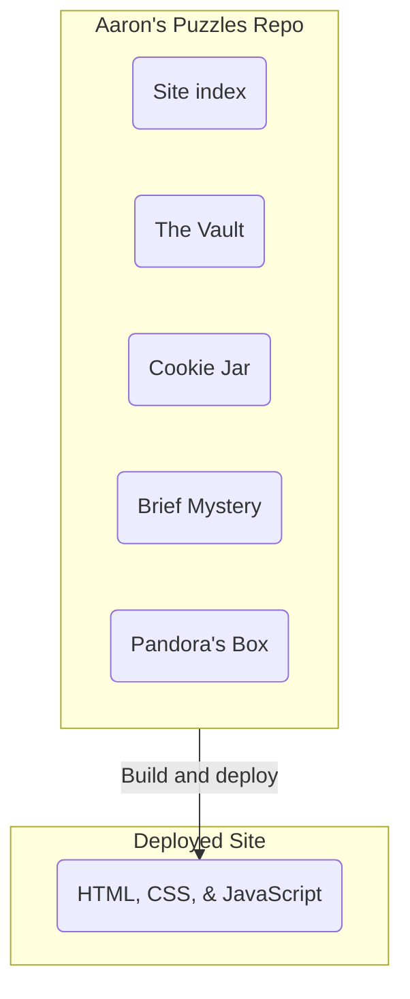
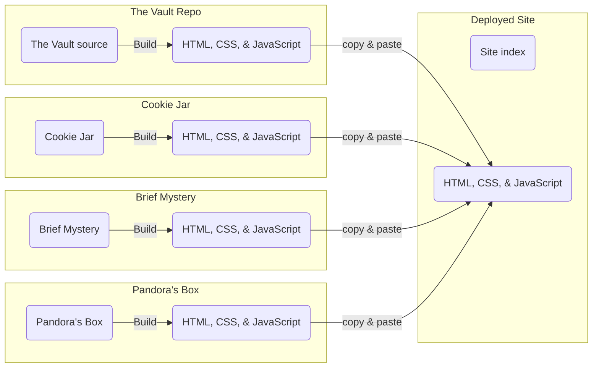

I built AaronsPuzzles.com like a tank. I needed a peashooter. 

# Original architecture:

Until 2026, aaronspuzzles.com was **one** code base. Every time I touched the website, I had to worry about breaking everything. Each new puzzle I wanted to add meant dealing with dependencies I used years ago that want to update themselves (and likely break what was already working).

Each website build (TypeScript build & bundle, I mean) amounted to rebuilding *everything* **every time**. 

## New architecture:

The new architecture splits every puzzle into its own repo, its own codebase. I build (compile & bundle) each puzzle ONCE in its own VS Code project. Then I manually copy/paste the contents of the `/dist` to the aaronspuzzles.com repo as **static HTML/CSS/JavaScript files**, and never have to touch it ever again. Dependencies are no longer being tacked on year over year. I no longer re-build everything. Things should never break again™️.

This way, puzzles become what they are - a snapshot of a point in time. This approach also completely opens up wholly new ways to build puzzles. I'm no longer locked into a particular framework for forever. I am no longer even required to use JavaScript as the development language, if I wanted. 
### Removed Dependency on "the Cloud"

My puzzle web pages have always worked locally, but they did assume that game progress was being saved to a Google Firestore cloud database. As part of this "one last rebuild for every puzzle" I am migrating to use in-browser storage & a dead simple Google Apps Script-based high score system that will fail elegantly (if it fails) and not affect user puzzle-solving experience.