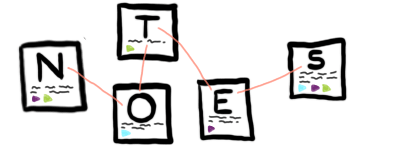
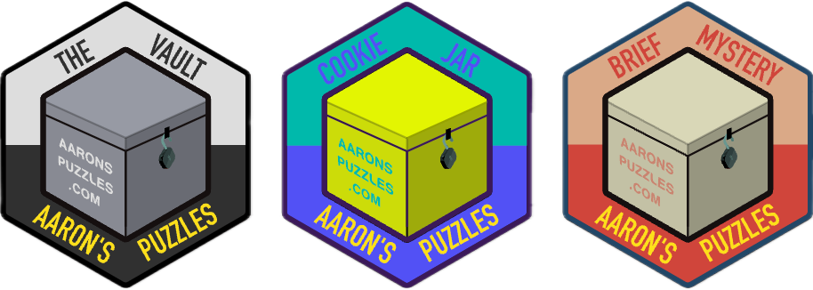
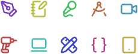
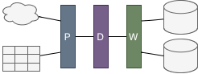

![[index-me-in-crowd.png]]

Hi. I'm Aaron. Welcome to my website. I'm glad you're here.

I write and create things to entertain and inform... mostly myself. I don't sell anything. I'm not here to make money. I'm here to enjoy myself; and I hope you do too. See what I'm up to [[Now]].

> [!success] Current Column → [[459]]
# Main Attractions
%%this works on Quartz%%
%%also comments are properly filtered out on Quartz. Nice.%%

	<a href="/Columns">
		
		
The Column

	</a>
	<a href="https://gillespedia.com">
		
		
Gillespedia

	</a>
	<a href="https://aaronspuzzles.com">
		
		
Aaron's Puzzles

	</a>

## Secondary Features

	<a href="https://shows.acast.com/we-scene-a-movie">
		
		
Movie Podcast

	</a>
	<a href="/Pages/Creations">
		
		
Creations

	</a>
	<a href="/Pages/PDW">
		
		
Personal Data Warehouse

	</a>

